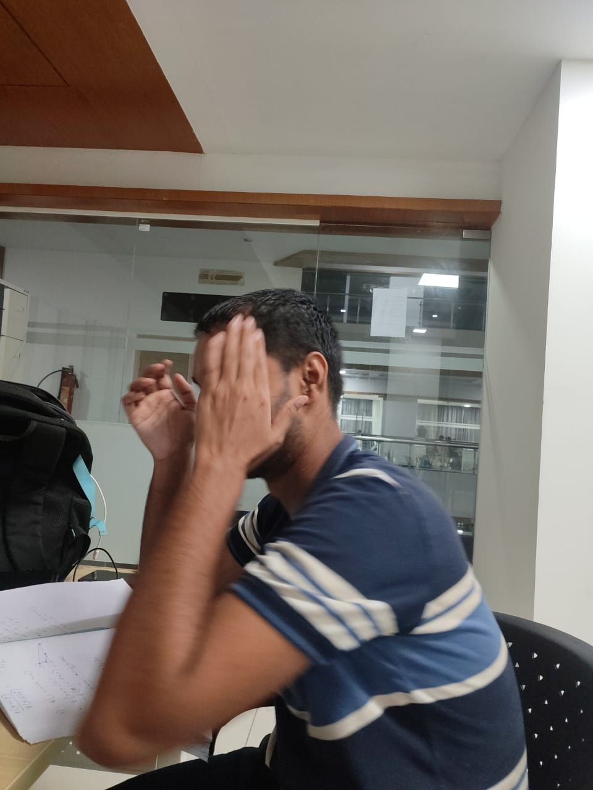
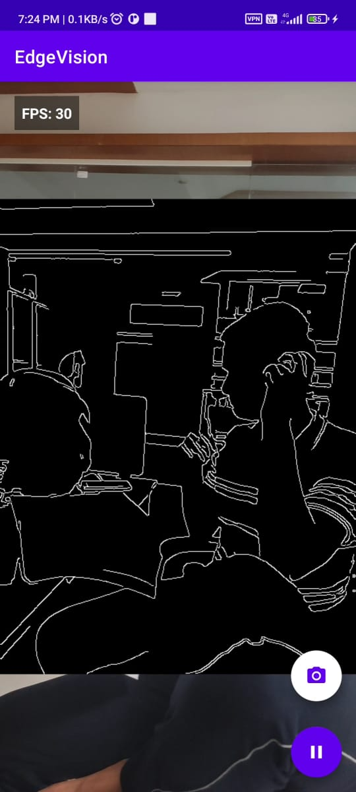

# Real-Time Edge Detection Viewer

An Android application that captures camera frames, processes them in real-time using OpenCV in C++, and streams the result to a web-based viewer.

---
| Original Image |Detected Edges |
|----------------|----------------|
|  |  |

## 🎥 Demo Video Link
Click on this Link to watch the Demo
[![Watch the video]](https://drive.google.com/file/d/17KttRtMs-2MwI6yIuWPRFjxU6tFkiki1/view?usp=sharing)


## 🌟 Features Implemented

### Android Application

-   **Real-time Camera Access**: Utilizes CameraX to access the device's camera and capture a live video feed.
-   **Native Image Processing**: Leverages the JNI to communicate with a native C++ module for high-performance image processing with OpenCV.
-   **Edge Detection**: Implements the Canny edge detection algorithm from OpenCV to process the camera frames.
-   **On-Device Preview**: Displays the processed video feed directly on the Android device's screen.
-   **WebSocket Streaming**: Streams the processed frames to a web-based viewer in real-time.
-   **Simple UI**: A simple user interface with a button to toggle the edge detection on and off.

### Web Viewer

-   **Real-time Video Display**: Receives and displays the processed video feed from the Android app in real-time.
-   **WebSocket Client**: Connects to the WebSocket server to receive the video stream.
-   **Real-time Statistics**: Displays statistics about the video stream, such as FPS and resolution.
-   **Built with TypeScript**: The web viewer is written in TypeScript for better code quality and maintainability.

---

## 🏗️ Architecture

The project follows a client-server architecture where the Android application acts as the client that captures and processes video, and the web application acts as the server and viewer.

### Frame Flow

1.  **Capture**: The **Android app** captures frames from the camera using **CameraX**.
2.  **JNI Bridge**: The captured frame is passed from Kotlin to a C++ function through the **JNI (Java Native Interface)**.
3.  **Process**: The **C++ code** uses **OpenCV** to perform edge detection on the frame.
4.  **Stream**: The processed frame is encoded as a Base64 string and sent over a **WebSocket** to the web server.
5.  **View**: The **TypeScript** web viewer receives the frame from the WebSocket and displays it in the browser.

### Components

-   **Android App**: Written in Kotlin, responsible for camera capture, UI, and communication with the native C++ code.
-   **Native C++ Module**: Uses OpenCV to perform heavy image processing tasks, ensuring high performance.
-   **Web Viewer**: A single-page application written in TypeScript that receives and displays the processed video feed.
-   **Node.js Server**: A simple Node.js server using `express` and `ws` to serve the web viewer and handle the WebSocket connection.

---

## 🚀 Getting Started

Follow these instructions to get the project up and running on your local machine.

### Prerequisites

Make sure you have the following software installed:

-   **Android Studio**: Arctic Fox or later.
-   **Android NDK**: Required for C++ native development. You can install it via the SDK Manager in Android Studio.
-   **OpenCV for Android SDK**: Download the SDK from the [OpenCV website](https://opencv.org/releases/) and place it in the root directory of the project.
-   **Node.js and npm**: Required for the web viewer. You can download them from the [Node.js website](https://nodejs.org/).

### 1. Clone the Repository

```bash
git clone https://github.com/your-username/flamwind.git
cd flamwind
```

### 2. Set up the Android Application

1.  **Open the project in Android Studio**: Open the `flamwind` directory in Android Studio.
2.  **Sync Gradle**: Let Android Studio sync the project with the Gradle files.
3.  **Configure the Web Viewer IP Address**:
    -   Find the IP address of your computer (the one that will run the web server). On Windows, you can use the `ipconfig` command in the Command Prompt. On macOS or Linux, use `ifconfig` or `ip addr`.
    -   Open the `app/src/main/java/com/example/edgevision/MainActivity.kt` file.
    -   Find the line `val uri = URI("ws://192.168.0.105:3000")` and replace `192.168.0.105` with the IP address of your computer.
4.  **Build and Run**: Build and run the app on an Android device or emulator.

### 3. Set up the Web Viewer

1.  **Navigate to the `web` directory**:
    ```bash
    cd web
    ```
2.  **Install dependencies**:
    ```bash
    npm install
    ```
3.  **Start the server**:
    ```bash
    npm start
    ```
4.  **Open the viewer**: Open your web browser and navigate to `http://localhost:3000`.

## 📱 Usage

1.  **Start the Android app**: Once the app is running on your device, you will see the camera feed.
2.  **Start the web viewer**: Make sure the web server is running (`npm start`) and you have the web viewer open in your browser.
3.  **Start processing**: On the Android app, tap the "play" button at the bottom right of the screen to start the edge detection.
4.  **View the result**: The processed video with the edges highlighted will appear on the screen of your Android device and in the web viewer.

## 🤔 Troubleshooting

Here are some solutions to common problems:

-   **Build failure: `compileDebugKotlin` failed**:
    -   Make sure you have the Android NDK installed and configured correctly in Android Studio.
    -   Ensure that the native build is enabled in `app/build.gradle`.
-   **No edge detection in the web viewer**:
    -   Make sure you have updated the IP address in `MainActivity.kt` to your computer's IP address.
    -   Check if your computer's firewall is blocking the connection on port 3000.
    -   Make sure your Android device and your computer are on the same network.
    -   Check the browser's developer console for any WebSocket errors.
-   **App crashes on start**:
    -   This might be due to an incorrect image format conversion. Make sure the `toBitmap()` function in `MainActivity.kt` is correctly handling the YUV format from the camera.
    -   Check the `logcat` in Android Studio for any errors.

## 🤝 Contributing

Contributions are welcome! If you want to contribute to this project, please follow these steps:

1.  Fork the repository.
2.  Create a new branch (`git checkout -b feature/your-feature`).
3.  Make your changes.
4.  Commit your changes (`git commit -m 'Add some feature'`).
5.  Push to the branch (`git push origin feature/your-feature`).
6.  Open a pull request.

## 📜 License

This project is licensed under the MIT License. See the `LICENSE` file for details.
